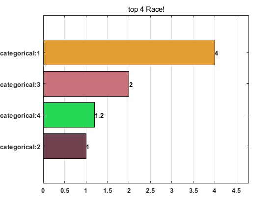
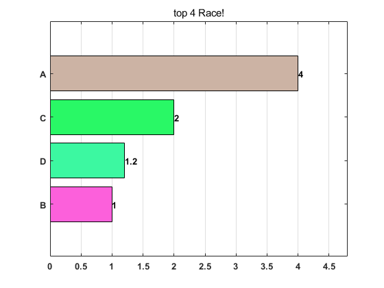
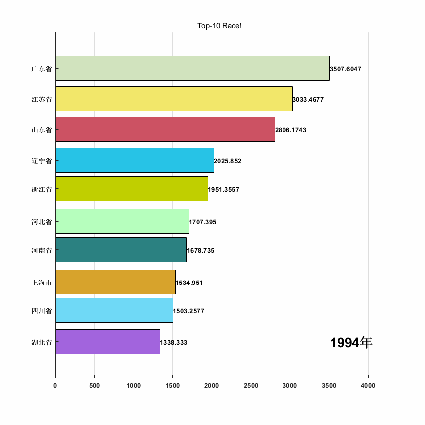

# 动态条形直方图（bar chart race）
此程序旨在用精简的代码产生美观的时间动态直方图，相对前人程序，支持topK显示，调用接口及其简单，方便使用！支持的功能有：指定topK、标签类别指定、类别颜色指定、显示帧率制定、生成GIF动画等。


# 示例一，直接生成动态直方图

```matlab:Code
indata = [4,4,4,4;
    1,5,5,1;
    2,2,2,2;
    1.2,1.2,1.2,1.2];% 行代表类别label,列代表时间序列
barChartRace2(indata);
```




  
# 示例二，指定类别标签

```matlab:Code
indata = [4,4,4,4;
    1,5,5,1;
    2,2,2,2;
    1.2,1.2,1.2,1.2];% 行代表类别label,列代表时间序列
labels = categorical(["A","B","C","D"]);% 与indata行数类别一一对应，标签label
h = barChartRace2(indata,"Categories",labels);
```




# 示例三，生成GIF动画,top10显示，设置播放速率，加右小角时间标注

```matlab:Code
%% 读入人均GDP数据
filename = '31省份1993-2018人均GDP.csv';
inData = readmatrix(filename,'Range','B5:AA35');
labelnames = readcell(filename,'Range','A5:A35');
timesStr = readcell(filename,'Range','B4:AA4');

% 整理成合适的格式
inData = fliplr(inData);
timesStr = fliplr(timesStr);
labels = categorical(labelnames);
barChartRace2(inData,...
    "TopK",10,...
    "Categories",labels,...
    "TimeLabels",timesStr,...
    "FramesPerDataTick",30,...
    "GenerateGIF",true);
```



